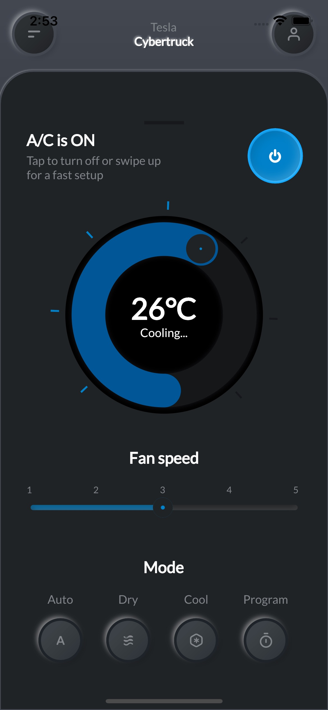
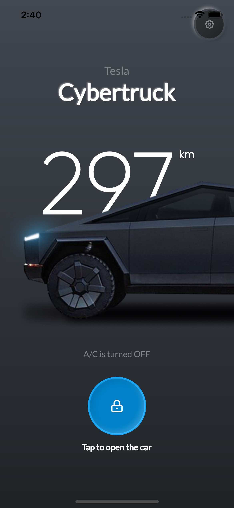
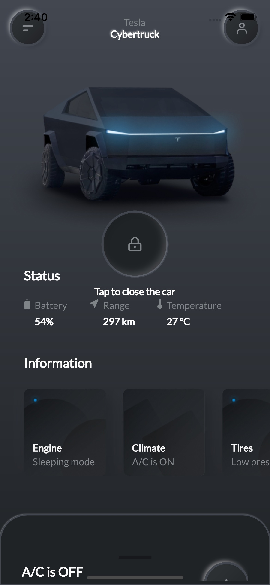
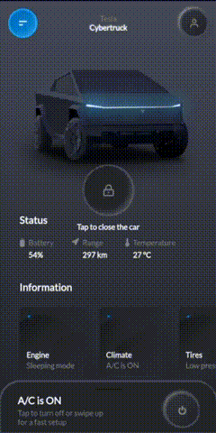

# tesla_app

Tesla app UI developed with Flutter.

## APK file
https://drive.google.com/file/d/1Q3Q4_LrVPve2536Bh6FluIfjNz2cDZPY

## Screenshots

| 1                                          | 2                                          |
|--------------------------------------------|--------------------------------------------|
|  |  |

| 3                                          | 4                                             |
|--------------------------------------------|-----------------------------------------------|
|  |  |


## Getting Started

This project is a starting point for a Flutter application.

A few resources to get you started if this is your first Flutter project:

- [Lab: Write your first Flutter app](https://docs.flutter.dev/get-started/codelab)
- [Cookbook: Useful Flutter samples](https://docs.flutter.dev/cookbook)

For help getting started with Flutter development, view the
[online documentation](https://docs.flutter.dev/), which offers tutorials,
samples, guidance on mobile development, and a full API reference.

## How to use

**Step 1**

Download or clone this repo by using the link below
```
https://github.com/enoch-aik/tesla_app.git
```

**Step 2**

Go to project root and execute the following command in console to get the required dependencies:

```
flutter pub get
```

## Hide Generated Files

In-order to hide generated files, navigate to `Android Studio` -> `Preferences` -> `Editor` -> `File Types` and paste the below lines under `ignore files and folders` section:

### Libraries & Tools Used

* [Flutter SVG](https://github.com/dnfield/flutter_svg) (SVG)
* [Google fonts](https://github.com/material-foundation/google-fonts-flutter) (Fonts)
* [Flutter ScreenUtil](https://github.com/OpenFlutter/flutter_screenutil) (Responsive UI)
* [Flutter neumorphic](https://github.com/Idean/Flutter-Neumorphic) (Neumorphic UI kit)
